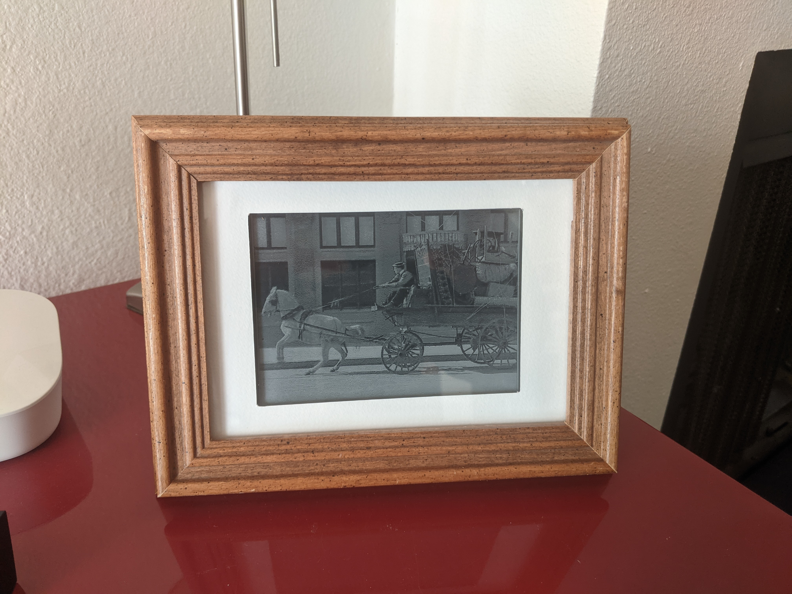
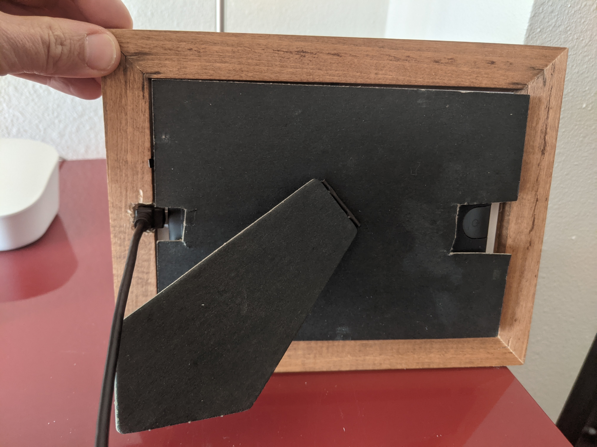

# Very Slow Movie Player for Nook Simple Touch

This project was inspired by [this article](https://makezine.com/projects/the-very-slow-movie-player/) in Make Magazine. It looks like a photograph in a frame, but it's actually playing a movie very slowly (1/300 speed ifor my implementation).  

That Make Magazine design uses a Raspberry Pi and an e-ink display, but I happened to have an old Nook Simple Touch (NST) e-reader in my closet, so I decided to try to build one with that.

A shout out to the folks at [the XDA NST forums](https://forum.xda-developers.com/c/barnes-noble-nook-touch.1198/) for their help!

The NST runs Android 2.1, which is quite old, and because of this I was unable to get the latest version of Android Studio (4.1.2 at time of writing) to install to it. I installed the oldest version of Android Studio available from Google (2.3) and it does work.  (If you figure out how to install with a newer version, let me know!)

## Equipment:
 - A Nook Simple Touch; the going rate on eBay seems to be about $30
 - A MicroSD card (32GB is plenty)
 - A picture frame large and deep enough to hold the NST

## Factory reset your NST (optional)

My NST was prone to random crashes, and doing a factory reset seemed to fix it.  If you want to do this, the best way is to use the n2T-Recovery_0.2.img (from the XDA forums, but also here in the img folder).  More detail can be found in those forums, but in brief:
 - Mount the SD card on your computer (e.g. using an SD card reader)
 - Write the img file to the SD card:

   `sudo dd if=./img/n2T-Recovery_0.2.img of=/dev/disk<n> bs=1m`

   where `<n>` is replaced with the number of your disk device.  (On OSX you can find that with `diskutil list`.)
 - Put the card in your NST and reboot

## Root your NST

This is done with NookManager, also available from the XDA forums but also here in the img folder.
- Mount the SD card on your computer
- Write the img file:

    `sudo dd if=./img/NookManager.img of=/dev/disk<n> bs=1m`

- **If your NST has been updated to firmware 1.2.2**, you will need to edit scripts/install_nookmods and scripts/install_old_installer on the SD card; change the line

    `if [ "$SYSTEM" != "1.2.0" -a "$SYSTEM" != "1.2.1" ]; then`

    to 

    `if [ "$SYSTEM" != "1.2.0" -a "$SYSTEM" != "1.2.1" -a "$SYSTEM" != "1.2.2"]; then`

- Put the card in your NST and reboot

## Set up the SD card

 - If you want to reuse the SD card from the previous steps, note that writing the .img file as we did previously means you lost access to most of the SD card capacity, so you will want to re-partition it; on OSX I used `diskutil` to do this.
 - Find some movie files: a good place for classic silent movies is [archive.org](https://archive.org/details/moviesandfilms), but really you can use any movie file.
 - Mount the SD card.
 - Convert the movie file to a series of images (optimized for the e-ink display) in a directory on the SD card using the `process.sh` script.
 - Put the SD card into your NST.
 - Build and and run the app with Android Studio.  If your computer automatically mounts the NST and its SD card as mine does, unmount them so the app can access the card.

## Put it in a frame
This will depend on what kind of frame you have, obviously.  Here's what I did for the one I happened to have at hand:

I used [this right-angle USB cable](https://www.amazon.com/gp/product/B00EBGGXS2/ref=ppx_yo_dt_b_asin_title_o00_s00?ie=UTF8&psc=1) and used a Dremel tool to make space for the cable. 

## Some notes on the app
The original design advanced one frame (i.e. 1/24 second for standard film) each minute, or 1/1400 speed.  I find the frame changes a little distracting, so my version advances the film by one second each five minutes, which means it plays 1/300 speed.  At that speed it will play through an hour of video in about 12 days.

At startup or when an SD card is inserted, it scans the card and makes a list of directories containing files in the format img%05d.jpg, starting with frame 1 (i.e. img00001.jpg).  After playing the last file in a directory, it will move on to the next in the list.  It also remembers the directory & frame number between launches.

Tapping the screen will toggle label at the bottom showing the current time and image file.  Tapping the far right/left side of the screen will go forward/back by 1 frame.  (These are meant for debugging, really; once the NST is in the frame, you lose access to the screen.)

